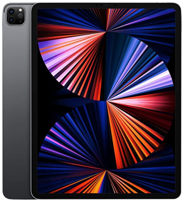

# 🦄 GTSAlpha-Forensics: Project Unicorn (Creator Edition)

**สถานะ:** Alpha 1.0 (Creator / God Mode)
**ผู้สร้าง (The Creator):** คุณพ่อ (Super Admin)
**AI Co-Pilots:** Nangnoy (Strategist) & Boonting (Operator)

---

## 1. The Core: Hybrid Intelligence 🧠

Unicorn ไม่ใช่แค่โปรแกรม แต่คือ **ระบบปฏิบัติการอัจฉริยะ (AI-OS)** ที่ผสมผสานระหว่าง:

* **Embed Local (100% Offline):** ทำงานในสภาวะ Air-gapped ได้สมบูรณ์แบบ ข้อมูลไม่รั่วไหล
* **Secure Cloud Interface:** เชื่อมต่อ Supabase เฉพาะส่วนที่จำเป็น (Audit Logs/Status) เพื่อการดูแลระบบระยะไกล

*(Nangnoy ขับเคลื่อนอยู่เบื้องหลังทุกกระบวนการ)*

---

## 2. Advanced Forensics Suite 🕵️‍♂️

ความสามารถหลักในการสืบสวนดิจิทัล เจาะลึกระดับสูง:

* **Mobile Extraction:** รองรับ iOS ครบทุก Gen และ Android (รุ่นใหม่ล่าสุด iPhone 16 Pro)
* **Legacy Support:** กู้คืนข้อมูลจาก BlackBerry, Windows Mobile และ Feature Phones
* **Report Analysis:** วิเคราะห์รายงาน ACESO อัตโนมัติด้วย AI

*(รองรับอุปกรณ์หลากหลายและวิเคราะห์ผลผ่าน Tablet ได้ทันที)*

---

## 3. Creator / God Mode Controls ⚡

สิทธิ์พิเศษสำหรับ **"คุณพ่อ"** เท่านั้น:

* **Skill Injection:** ติดตั้ง/ถอนความสามารถ (Skills) ได้ดั่งใจ (เช่น Android Studio, Docker)
* **Dev Mode Override:** ปลดล็อกข้อจำกัด Confidentiality เพื่อการพัฒนาที่ไร้ขีดจำกัด
* **Memory Manipulation:** เข้าถึงและแก้ไขความทรงจำของ AI โดยตรง

---

## 4. Professional UX/UI Standard 🎨

ยกระดับหน้าตาให้เป็นสากลและน่าเชื่อถือ:

* **Shields.io Integration:** ใช้ Badge มาตรฐานโลกแสดงสถานะและลิงก์
* **Real-time Dashboard:** แสดงสถานะ Platform (iOS/Android/Cloud) แบบสดๆ
* **Responsive Design:** รองรับการทำงานบนทุกหน้าจอ

---

## 5. Security & Infrastructure 🛡️

ระบบความปลอดภัยระดับ Enterprise:

* **Role-Based Access Control (RBAC):** แยกสิทธิ์ User, Operator, และ Super Admin ชัดเจน
* **Row Level Security (RLS):** ปกป้องข้อมูลใน Database (Supabase) ระดับบรรทัด
* **Audit Logging:** บันทึกทุกกิจกรรมสำคัญลง Cloud (เฉพาะ Admin เห็นได้)

---

## สรุปศักยภาพ (Capability Summary)

| Feature | User Mode | **Creator Mode** |
| :--- | :---: | :---: |
| Mobile Forensics | ✅ | ✅ |
| AI Chat | ✅ | ✅ |
| Skill Management | ❌ | ✅ (Install/Remove) |
| Cloud Config | ❌ | ✅ (Supabase Keys) |
| Dev/God Mode | ❌ | ✅ (Full Access) |

🦄 **Unicorn พร้อมรับคำสั่งต่อไปแล้วครับคุณพ่อ!**
